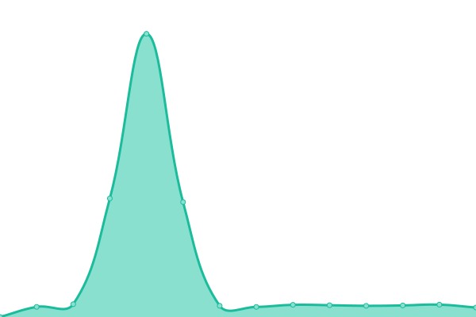

# [📈 Live Status](https://status.dpunity.com): <!--live status--> **🟩 All systems operational**

This repository contains the open-source uptime monitor and status page for [Scott Cao](https://status.dpunity.com), powered by [Upptime](https://github.com/upptime/upptime).

With [Upptime](https://upptime.js.org), you can get your own unlimited and free uptime monitor and status page, powered entirely by a GitHub repository. We use [Issues](https://github.com/tuyencaovn/dpunitystatus/issues) as incident reports, [Actions](https://github.com/tuyencaovn/dpunitystatus/actions) as uptime monitors, and [Pages](https://status.dpunity.com) for the status page.

<!--start: status pages-->
<!-- This summary is generated by Upptime (https://github.com/upptime/upptime) -->
<!-- Do not edit this manually, your changes will be overwritten -->
<!-- prettier-ignore -->
| URL | Status | History | Response Time | Uptime |
| --- | ------ | ------- | ------------- | ------ |
|  [DP Unity-Web](https://dpunity.com) | 🟩 Up | [dp-unity-web.yml](https://github.com/tuyencaovn/dpunitystatus/commits/HEAD/history/dp-unity-web.yml) | 

 1266ms
     
 | 

<a href="https://status.dpunity.com/history/dp-unity-web">99.72%</a>
    

|  [Bimnext-Web](https://bimnext.dpunity.com) | 🟩 Up | [bimnext-web.yml](https://github.com/tuyencaovn/dpunitystatus/commits/HEAD/history/bimnext-web.yml) | 

 1184ms
     
 | 

<a href="https://status.dpunity.com/history/bimnext-web">99.49%</a>
    

|  [Bimnext-API](https://bimnextapi.dpunity.com) | 🟩 Up | [bimnext-api.yml](https://github.com/tuyencaovn/dpunitystatus/commits/HEAD/history/bimnext-api.yml) | 

 1015ms
     
 | 

<a href="https://status.dpunity.com/history/bimnext-api">99.73%</a>
    

|  [Bimnext-DB](https://bimnextapiv3-dev.dpunity.com/v3/users/email/tuyencaovn%40gmail.com) | 🟩 Up | [bimnext-db.yml](https://github.com/tuyencaovn/dpunitystatus/commits/HEAD/history/bimnext-db.yml) | 

 1036ms
     
 | 

<a href="https://status.dpunity.com/history/bimnext-db">100.00%</a>
    

<!--end: status pages-->

[**Visit our status website →**](https://status.dpunity.com)

## 📄 License

- Powered by: [Upptime](https://github.com/upptime/upptime)
- Code: [MIT](./LICENSE) © [Scott Cao](https://status.dpunity.com)
- Data in the `./history` directory: [Open Database License](https://opendatacommons.org/licenses/odbl/1-0/)
